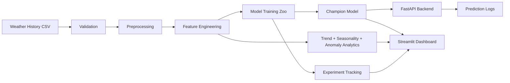

# RainSense AI

RainSense AI is a portfolio-grade rainfall prediction and weather intelligence platform. It combines data validation, feature engineering, multi-model machine learning, explainable AI, advanced weather analytics, a Streamlit dashboard, and a FastAPI prediction backend.

## Project Overview

RainSense AI predicts whether rain is likely from weather observations such as temperature, humidity, pressure, wind speed, cloud cover, and sunshine hours. The project is designed like a real ML product: it generates a reproducible sample dataset, trains and compares several model families, persists champion artifacts, exposes API endpoints, logs predictions, and presents model insights in an interactive dashboard.

## Architecture



## Dataset Information

The included sample dataset is generated at `data/raw/weather_history.csv` with 1,500 daily observations from 2020 onward. It simulates realistic weather relationships, seasonal rainfall, missing humidity values, and wind-speed outliers so the preprocessing pipeline has meaningful work to do.

Key fields:

- `temperature`
- `humidity`
- `pressure`
- `wind_speed`
- `cloud_cover`
- `sunshine_hours`
- `rainfall_mm`
- `rain`

## Technologies Used

Python, Pandas, NumPy, Scikit-Learn, XGBoost, LightGBM, TensorFlow/Keras, Streamlit, FastAPI, SHAP, Plotly, Matplotlib, Docker, Pytest.

## Installation Guide

```bash
cd RainSense-AI
python3 -m venv .venv
source .venv/bin/activate
pip install -r requirements.txt
python train.py
```

Run the dashboard:

```bash
streamlit run app.py
```

Run the API:

```bash
uvicorn src.api.main:app --reload
```

Try the CLI predictor:

```bash
python predict.py \
  --temperature 29 \
  --humidity 82 \
  --pressure 1002 \
  --wind-speed 18 \
  --cloud-cover 76 \
  --sunshine-hours 3 \
  --month 7
```

## Dashboard Screenshots


The dashboard is implemented in `dashboard/streamlit_app.py` with four sections:

- Home: weather summary, animated visual background, rainfall trend, model overview
- Prediction: interactive rainfall probability and confidence scoring
- Analytics: heatmaps, monthly trends, forecasts, seasonal comparisons, anomaly detection
- Model Insights: feature importance, model leaderboard, SHAP-ready explainability hooks

## Model Performance Results

Latest local training run selected **XGBoost** as the champion model.

| Model | Accuracy | Precision | Recall | F1 | ROC-AUC |
|---|---:|---:|---:|---:|---:|
| XGBoost | 0.8295 | 0.8456 | 0.8129 | 0.8289 | 0.8774 |
| Gradient Boosting | 0.8262 | 0.8446 | 0.8065 | 0.8251 | 0.8783 |
| LightGBM | 0.8262 | 0.8446 | 0.8065 | 0.8251 | 0.8751 |
| Random Forest | 0.8295 | 0.8652 | 0.7871 | 0.8243 | 0.8884 |
| Logistic Regression | 0.8230 | 0.8633 | 0.7742 | 0.8163 | 0.8958 |
| TensorFlow/Keras Neural Network | 0.8131 | 0.8356 | 0.7871 | 0.8106 | 0.8874 |
| Decision Tree | 0.7902 | 0.7791 | 0.8194 | 0.7987 | 0.8084 |

Artifacts are written to `models/`, including `latest_model.joblib`, `metrics.json`, `model_info.json`, and `experiments.csv`.

## API Endpoints

- `GET /health`
- `POST /predict`
- `GET /model-info`
- `GET /metrics`

Example:

```bash
curl -X POST http://127.0.0.1:8000/predict \
  -H "Content-Type: application/json" \
  -d '{
    "temperature": 29,
    "humidity": 82,
    "pressure": 1002,
    "wind_speed": 18,
    "cloud_cover": 76,
    "sunshine_hours": 3,
    "month": 7
  }'
```

## MLOps Features

- Model version metadata in `models/model_info.json`
- Experiment tracking in `models/experiments.csv`
- Prediction logging in `logs/predictions.jsonl`
- Automated retraining entry point in `retrain.py`
- Dockerized API and dashboard deployment

## Deployment Guide

See `docs/DEPLOYMENT.md` for Docker, AWS, Render, and Railway instructions.

Quick Docker start:

```bash
docker build -t rainsense-ai .
docker run -p 8000:8000 rainsense-ai
```

## Future Improvements

- Replace synthetic sample data with NOAA, Open-Meteo, or IMD production feeds
- Add MLflow or Weights & Biases tracking
- Store model artifacts in S3/GCS
- Add drift detection and alerting
- Add scheduled retraining with Airflow, Prefect, or GitHub Actions
- Extend monthly forecasting with Prophet, ARIMA, or temporal deep learning

## License

MIT License.

## Author Information

Built as a professional AI/ML engineering portfolio project. Update this section with your name, GitHub profile, LinkedIn profile, and portfolio URL before publishing.
