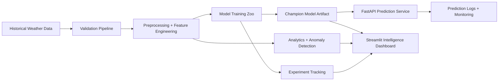

# Architecture

```mermaid
flowchart LR
    A["Historical Weather Data"] --> B["Validation Pipeline"]
    B --> C["Preprocessing + Feature Engineering"]
    C --> D["Model Training Zoo"]
    D --> E["Experiment Tracking"]
    D --> F["Champion Model Artifact"]
    F --> G["FastAPI Prediction Service"]
    F --> H["Streamlit Intelligence Dashboard"]
    C --> I["Analytics + Anomaly Detection"]
    I --> H
    E --> H
    G --> J["Prediction Logs + Monitoring"]
```

